# 第1章 并发编程挑战

## 1.1 上下文切换

### 1.1.1 概念

多个线程并发执行时，当切换线程时，需要保存线程的状态，切回去时需要恢复原来的状态，此之为线程切换。线程切换会带来性能开销。

### 1.1.2 测试线程切换的工具

- vmstat  这个centos自己有
- Lmbench   这个需要装 [官网](http://www.bitmover.com/lmbench/)

### 1.1.3 如何减少上下文切换

- 无锁并发编程
- 使用CAS算法
- 使用最少的线程
- 使用协程


### 1.1.4 使用jstack能够dump线程信息

## 1.2 死锁

### 1.2.1 死锁问题排查

通过dump线程信息来排查

### 1.2.2 死锁的避免

- 避免同一个线程同时获取多个锁
- 避免一个线程在锁内占用多个资源，尽量只占用一个资源
- 尝试使用定时锁 tryLock
- 对于数据库锁，加锁和解锁必须在一个数据库连接里

## 1.3 资源限制

### 1.3.1 哪些资源限制

- 带宽上传下载速度
- 硬盘读写速度
- cpu处理速度
- 数据库连接数和socket连接数限制

### 1.3.2 解决方案


1. 集群
2. 连接池技术
3. 根据资源情况调整程序的并发度


# 第2章 java并发机制的底层实现原理

java代码执行流程


## 2.1 volatile

### 介绍

- 轻量级的synchronized，不会引起线程上下文切换
- 保证共享变量可见性，即一个线程修改共享变量时，其他线程能读到修改后的值

### 原理

加volatile后编译成的汇编指令会多一个lock，然后cpu会对这个lock做一些特殊处理：

1. lock前缀指令会引起处理器缓存回写到内存
2. 一个处理器将缓存回写回内存会导致其他处理器缓存无效

### volatile使用优化

追加字节使得数据不在一个缓存行。java7及以上不可用。

## 2.2 synchronized原理与应用

### 2.2.1 synchronized的三种形式

1. 普通同步方法，锁为当前实例对象
2. 静态同步方法，锁为当前类的Class对象
3. 同步代码块，锁为（）里边的那个对象

### 2.2.2 原理

JVM基于进入和退出Monitor对象来实现方法同步和代码块同步。

### 2.2.3 对象头

synchronized的锁信息是存储在对象头中的，数组3个子宽存对象头，非数组2个子宽。64为机器 1子宽=8byte（64bit）


### 2.2.4 锁的升级与对比

jdk1.6 为提高性能引入 偏向锁-> 轻量级锁-> 重量级锁


锁能升级，不能降级


#### 偏向锁

- 概念

当一个线程访问同步块并获得了锁的时候，会在对象头的锁记录中存储偏向的线程id， 以后该线程进入或退出该同步块时不需要进行CAS操作来加锁和释放锁，只需要测试一下对象偏向锁里的id是不是自己的线程id，如果是就是获得了锁，不是就要看当前是不是偏向锁，不是偏向锁则cas竞争锁，否则该偏向锁里边的id为自己

- 好处

让同一个线程重复获取锁和释放锁的效率变高了

- 获取和撤销流程

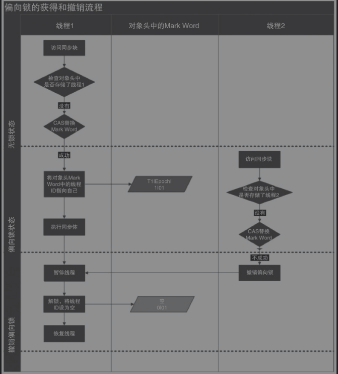


- 相关jvm参数

默认需要几秒后才激活偏向锁，可以通过如下参数设置无延迟

```
-XX:BiasedLockingStartupDelay=0
```

关闭锁

```
-XX:+UseBiasedLocking
```

#### 轻量级锁

- 锁的获取

线程进入同步代码块前，jvm会在当前线程的栈帧创建存储锁记录的空间，然后将对象头mark work拷贝到栈帧锁记录，然后尝试CAS将对象头锁记录执行栈帧锁记录，成功则获得锁，否则尝试利用自旋或则锁。


- 锁的释放

CAS将栈帧锁记录拷贝回对象头，成功则释放成功，否则膨胀成为重量级锁。

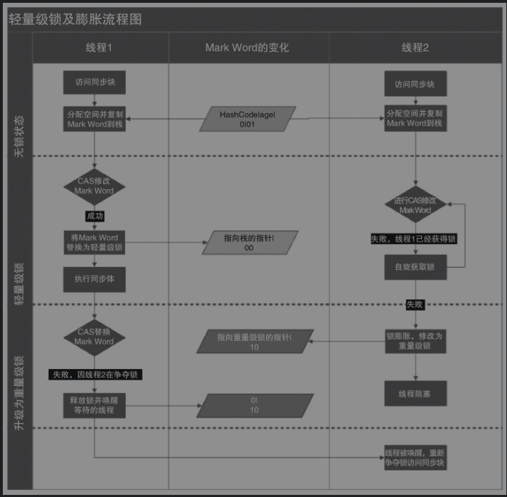

<center>轻量级锁及其膨胀流程</center>

#### 重量级锁

内置锁在Java中被抽象为监视器锁（monitor）。在JDK 1.6之前，监视器锁可以认为直接对应底层操作系统中的互斥量（mutex）。这种同步方式的成本非常高，包括系统调用引起的内核态与用户态切换、线程阻塞造成的线程切换等。因此，后来称这种锁为“重量级锁”。

#### 锁的对比


|锁|优点|缺点|适用场景|
|----|----|----------|----|
|偏向锁|同一个线程加锁解锁不需要额外消耗|如果存在竞争，会带来额外的锁撤销消耗|适用于只有一个线程访问同步块的场景|
|轻量级锁|竞争不会引起阻塞，提高了程序响应速度|长时间得不到锁的线程会一直自旋消耗cpu|追求响应时间，同步块执行速度快|
|重量级锁|竞争不自旋，不消耗cpu|线程阻塞，响应慢|追求吞吐量，同步块执行比较慢|


## 原子操作的实现原理

### 定义

不可中断的一个或一系列操作叫原子操作

### cpu如何实现原子操作

1. 使用总线锁
2. 通过缓存锁实现

### java如何实现原子操作

#### 使用循环CAS实现

##### 原子操作类

- AtomicBoolean
- AtomicInteger
- AtomicLong

他们基本头提供了compareAndSet、get、getAndSet 这样的方法

##### CAS实现原子操作的三大问题

- ABA问题

cas操作基于期望值是不是和之前的值是否一样来实现，可能存在一个一个值为A，然后变成B，然后又变为A， 此时会认为这个值没有变化，其实变化了。

解决方法：使用版本号，jdk也提供了AtomicStampedReference实现

- 循环时间长的话开销大

cas如果长时间不成功会给cpu带来很大的开销。

解决方法：支持cpu的pause指令

- 只能保证一个共享变量的操作

解决：想办法把几个变量合并成一个；使用jdk提供的AtomicReference保证引用对象之间的原子性


#### 使用锁来实现原子性

这没啥好说的


# 第3章 java内存模型

## 3.1 内存模型的基础

### 3.1.1并发编程模型中的两个关键问题

- 线程间如何通信

概念：如何交换信息

方式：
1. 共享内存，隐式通信
2. 消息传递，显示通信
- 线程间如何同步

概念：控制不同线程间操作发生的相对顺序的机制

共享内存并发模型中（java采用的方式）：同步是显示的，必须手动指定某个方法或某段代码需要互斥执行

消息传递并发模型中：同步是隐式的，消息发送必须在接受之前


### 3.1.2 Java内存模型抽象结构

- 所有实例变量、类变量、数组元素存在堆内存
- 堆内存在线程间共享
- 局部变量不共享，不存在可见性问题

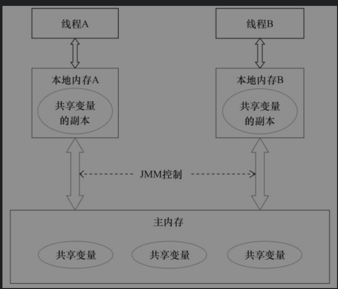

<center>java并发编程艺术-java内存模型的抽象结构</center>

> 图中本地内存是抽象的概念，并不真实存在


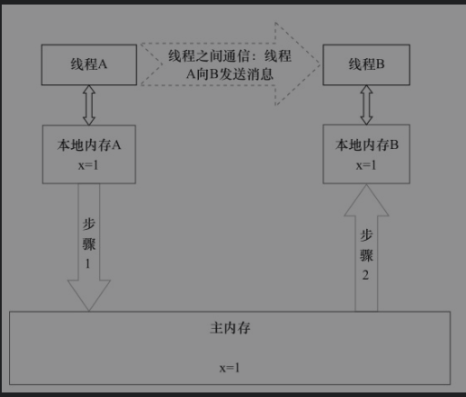

<center>java并发编程艺术-java线程通信模型</center>


### 3.1.3 从源代码到指令序列的重排序

1. 编译器优化的重排序
2. 指令级并行的冲排序
3. 内存系统的重排序

> 2、3属于处理器指令重排序

JMM（java memory model）通过内存屏障禁止特定类型的处理器重排序，保证内存可见性。


### 3.1.4 happens-before规则

如果一个操作的结果需要对另一个操作可见，必须满足happens-before规则

- 程序顺序规则：一个线程中的每个操作，happens-before于该线程的任意后续操作
- 监视器锁规则：对于一个锁的解锁，happens-before于随后对这个锁的加锁
- volatile变量规则：对于一个volatile的写，happens before于后续任意对他的读
- 传递性：如果A happens before 于B ，B hb于C，那么A hb 于C

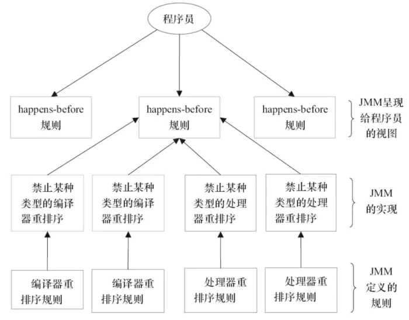

<center>happens-before</center>


## 3.2 重排序

重排序是编译器或处理器为了优化程序性能对指令序列进行重新排列的过程。

### 3.2.1 数据依赖性

两个操作访问同一个变量，并且至少有一个写操作，即存在数据依赖性。

编译器和处理器对单线程的存在数据依赖性的操作不会做冲排序，多线程的数据依赖性则不被考虑。

### 3.2.2 as-if-serial语义

意思是，无论如何重排序，单线程程序执行结果不能变，编译器和处理器都遵循子原则。

### 3.2.3 程序顺序规则

如果两个操作不具有数据依赖性，那么就是可以重排序的。

### 3.2.4 重排序对多线程的影响

单线程，无影响，多线程有影响。

> 这一节感觉说了一堆，其实就是说明了一个问题，编译器和cpu可能对指令重排序，存在数据依赖性的在单线程不会重排序，没问题，在多线程下会有问题。

## 3.3 顺序一致性

如果程序是正确同步的（synchronized, volatile, final），程序执行将具有顺序一致性;否则不具有顺序一致性。

JMM不保证对64为的long和double写操作的原子性， 查阅了一些资料：64为操作系统是能保证的 [参考资料](https://juejin.im/entry/595a43535188250d914dc7d3)；后文也说了 加volatile可以保证操作的原子性


## 3.4 volatile的内存语义

### 3.4.1 volatile的特性

对volatile变量的单独的读写可以看作是对变量的读写加了锁，也即是对volatile的读总能看到最后一个线程对他的写。

- 内存可见性。读volatile总能看到最新的
- 原子性：读写操作具有原子性，类似于volatile++的复合操作不具有原子性

### 3.4.2 volatile读-写内存语义

写内存语义：当写一个volatile变量时，JMM会将本地内存中的共享变量刷新到主内存中

读内存语义：当读一个volatile变量时，JMM会将本地内存的变量标识为无效，从主内存中读取


### 3.4.3 volatile内存语义的实现

简言之就是：编译器生成字节码时会通过加入内存屏障来阻止cpu对volatile变量读写操作的重排序。

书中提到了一篇参考文章[正确使用 Volatile 变量
](https://www.ibm.com/developerworks/cn/java/j-jtp06197.html)

volatile和锁的区别就是

锁能保证一组操作的原子性

但是volatile只能保证单个操作是原子的

## 3.5 锁的内存含义

### 3.5.1 锁的释放和获取的内存语义

和volatile是一样的

释放：释放时将本地内存中的共享变量刷到主内存
获取：获取时标识本地内存为无效，重新从主内存读取


### 3.5.2 锁内存的语义实现

ReentrantLock 实现依赖同步器框架AbstractQueuedSyncronizer(AQS),AQS使用整形volatile变量state维护同步状态。

- 公平锁和非公平锁释放时，最后都要写一个volatile变量state
- 公平锁获取时，都会先读volatile变量
- 非公平锁获取时，先使用CAS更新volatile，这个操作同时具有volatile读和写的内存语义

### 3.5.3 concurrent包的实现

实现基本模式

1. 声明共享变量为volatile
2. 使用CAS更新来实现线程同步，同时配合volatile读写内存语义和CAS读写内存语义实现线程通信


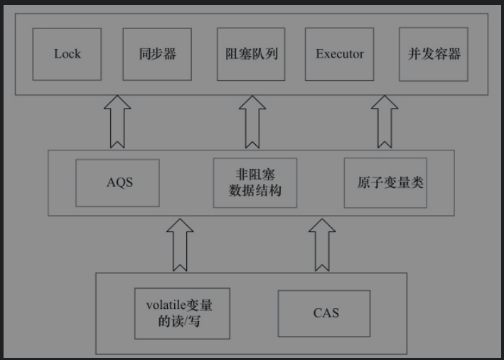

<center>java并发编程艺术-concurrent包实现基本原理</center>


## 3.6 final域的内存语义

### 3.6.1 final域重排序规则
- 在构造函数内对一个final域的写入，与随后把这个被构造对象的引用赋值给一个引用变量，这两个操作之间不能重排序
- 初次读一个包含final域的对象的引用，与随后初次读这个final域，这两个操作之间不能重排序

### 3.6.2 写final域的重排序规则

- JMM禁止编译器把final域的写重排序到构造函数之外
- 编译器会在final域的写之后，构造函数return之前，插入一个StoreStore屏障。这个屏障禁止处理器把final域的写重排序到构造函数之外

final域的重排序规则保证：

**在对象引用为任意线程可见之前，对象的final域已经被正确初始化过了，而普通域不具有这个保障**

### 3.6.3 读final域的重排序规则

在一个线程中，初次读对象引用与初次读该对象包含的final域，JMM禁止处理器重排序这两个操作

这个规则保证：

在读一个对象的final域之前，一定会先读包含这个final域的对象的引用

### 3.6.4 final域为引用类型

在构造函数内对一个final引用的对象的成员域的写入，与随后在构造函数外把这个被构造对象的引用赋值给一个引用变量，这两个操作之间不能重排序。


## 3.7 happens-before

### 3.7.1 JMM 的设计

设计考虑的因素

- 程序员：期望一个强内存模型。
- 编译器处理器：期望束缚少的弱内存模型
- JMM： 找到两者的平衡点

基本策略

- 会改变程序执行结果的重排序：禁止
- 不会改变执行结果的冲排序：允许

### 3.7.2 happens-before的定义

- 如果一个操作happens-before另一个操作，那么第一个操作的执行结果将对第二个操作可见，而且第一个操作的执行顺序排在第二个操作之前
- 如果重排序之后的执行结果，与按happens-before关系来执行的结果一致，那么这种重排序并不非法

### 3.7.3 happens-before规则

- 程序顺序规则：一个线程中的每个操作，happens-before于该线程中的任意后续操作。
- 监视器锁规则：对一个锁的解锁，happens-before于随后对这个锁的加锁。
- volatile变量规则：对一个volatile域的写，happens-before于任意后续对这个volatile域的读。
- 传递性：如果A happens-before B，且B happens-before C，那么Ahappens-before C。
- start()规则：如果线程A执行操作ThreadB.start()（启动线程B），那么A线程的ThreadB.start()操作happens-before于线程B中的任意操作。
- join()规则：如果线程A执行操作ThreadB. join()并成功返回，那么线程B中的任意操作happens-before于线程A从ThreadB. join()操作成功返回。

## 3.8 双重检查锁定与延迟初始化

有时候需要采用**延迟初始化**来降低初始化类和创建对象的开销。双重检查锁定是常见的延迟初始化技术，但它是一个**错误**的用法。


## 3.8.1 双重检查锁定的由来

对于传统的懒汉模式的单例模式实现，在多线程并发获取实例时可能导致你的单例变为多例。

```java
public class SingleInstance {
    private static SingleInstance instance;
    
    public SingleInstance getInstance() {
        if (instance == null) {
            instance = new SingleInstance();
        }
        return  instance;
    }
}
```

解决方法时 对获取单例的方法加锁，但是他会导致性能损耗, 由此出现了双重锁定。


双重锁定的解决方案

```
public class DoubleCheckLocking {
    private static DoubleCheckLocking instance;

    public DoubleCheckLocking getInstance() {
        if (instance == null) {
            synchronized (DoubleCheckLocking.class) {
                if (instance == null) { // 问题发生在这（xx）
                    instance = new DoubleCheckLocking();
                }
            }
        }

        return instance;
    }
}
```

我们new 一个对象其实经历了三个步骤

1. 分配对象内存  `memory=allocate()`
2. 初始化对象   `ctorInstance(memory)`
3. 引用指向创建的对象  `instance=memory`

其中2，3可能重排序, 上述双重锁定方案中，xx处多线程访问时，可能出现访问到未被初始化的对象


## 3.8.2 终级解决方案 volatile方案

直接将上述instance变量声明为volatile变量即可

## 3.8.3 终极方案 基于类初始化

```
public class MySingleInstance {
    private static class InstanceHolder{
        public static MySingleInstance instance = new MySingleInstance();
    }
    public MySingleInstance getInstance() {
        return InstanceHolder.instance;
    }
}
```

这个方案的基本原理是:

JVM在类的初始化阶段（即在Class被加载后，且被线程使用之前），会执行类的初始化。在执行类的初始化期间，JVM会去获取一个锁。这个锁可以同步多个线程对同一个类的初始化。

## 3.9 java内存模型总结

### 3.9.1 处理器内存模型

顺序一致性内存模型是一个理论模型，处理器内存模型和JMM读参考他，但是限制会弱。处理器内存模型比JMM要弱，所以java编译器生成字节码时会通过加入内存屏障组织处理器对某些指令做重排序。

### 3.9.2 内存模型的比较

- JMM是一个语言级的内存模型
- 处理器内存模型是硬件级的内存模型
- 顺序一致性内存模型是一个理论参考模型

### 3.9.3 JMM内存可见性的保证

- 单线程程序：不存在可见性问题
- 正确同步的多线程程序：具有顺序一致性
- 未同步或未正确同步的多线程：提供最小安全性保障


### 3.9.4 JSR-133对内存模型的修补

jdk>5

- 增强volatile内存语义
- 增强final内存语义

# 第4章 Java并发编程基础


## 4.1 线程简介

### 4.1.1 线程的定义

- 系统调度的最小单元
- 轻量级进程
- 多个线程可以共享内存变量
- 多个线程拥有各自的计数器、堆栈、局部变量


### 4.1.2 使用线程的目的

- 可以充分利用多处理器核心
- 更快的响应时间，可以将数据一致性要求不强的工作交给别的线程做
- 更好的编程模型


### 4.1.3 线程优先级

决定线程需要多分配还是少分配处理器资源的属性

可以通过线程的setPriority(int)方法设置优先级


### 4.1.4 线程的状态

java线程的生命周期中可能存在6中状态

1. 初始(NEW)：新创建了一个线程对象，但还没有调用start()方法。
2. 运行(RUNNABLE)：Java线程中将就绪（ready）和运行中（running）两种状态笼统的称为“运行”。
线程对象创建后，其他线程(比如main线程）调用了该对象的start()方法。该状态的线程位于可运行线程池中，等待被线程调度选中，获取CPU的使用权，此时处于就绪状态（ready）。就绪状态的线程在获得CPU时间片后变为运行中状态（running）。
3. 阻塞(BLOCKED)：表示线程阻塞于锁。
4. 等待(WAITING)：进入该状态的线程需要等待其他线程做出一些特定动作（通知或中断）。
5. 超时等待(TIMED_WAITING)：该状态不同于WAITING，它可以在指定的时间后自行返回。
6. 终止(TERMINATED)：表示该线程已经执行完毕。

状态的变迁


来源: [Java线程的6种状态及切换(透彻讲解)
](https://blog.csdn.net/pange1991/java/article/details/53860651)


### 4.1.5 Daemon线程

- 守护线程、也叫后台线程
- 用于做一些支持工作
- 同各国setDatemon(true) 将一个线程设置为Daemon线程
- jvm中没有非daemon线程时，jvm退出，daemon线程自动死亡


## 4.2 启动和终止线程

### 4.2.1 构造线程


一个新构造的线程对象是由其parent线程来进行空间分配的，而child线程继承了parent是否为Daemon、优先级和加载资源的contextClassLoader以及可继承的ThreadLocal，同时还会分配一个唯一的ID来标识这个child线程。至此，一个能够运行的线程对象就初始化好了，在堆内存中等待着运行。


### 4.2.2 启动线程

调用start方法启动线程，当前线程（即parent线程）同步告知Java虚拟机，只要线程规划器空闲，应立即启动调用start()方法的线程。

### 4.2.3 理解中断

中断可以理解为线程的一个标识位属性，它表示一个运行中的线程是否被其他线程进行了中断操作。

- 可以通过`isInterrupted()`方法查是否被中断

- 可以调用`interrupt()` 对其他线程中断

- 可以调用`Thread.interrupted()`让中断状态复位


### 4.2.5 安全终止线程

- 通过中断操作来终止线程
- 通过一个变量来控制任务是否继续继续执行下去


## 4.3 线程之间的通信

### 4.3.1 volatile和syncronized


多个线程访问共享变量时会拥有这个变量的副本，目的是加速运行，问题是线程里拿到的值可能不是最新的

- volatile: 保证内存可见性，告知程序读时需要从主内存读，写时需要立即刷新到主内存，过多使用volatile是不必要的，会降低程序执行效率

- syncronized: 保证线程对变量访问的可见性和排他性。任何一个时刻只能有一个线程在同步块或同步方法中


### 4.3.2 等待通知机制

等待/通知的相关方法是任意Java对象都具备的，因为这些方法被定义在所有对象的超类java.lang.Object上。

几个方法

- notify: 通知一个对象上等待的线程，使其从wait方法返回，而返回的前提是该线程获取到了对象的锁
- notifyAll: 通知一个对象上等待的线程，使其从wait方法返回
- wait: 使线程进入WAITING状态，只有等待另一个线程**通知或者被中断**才返回，需要注意的是，调用wait方法后需要**释放对象的锁**
- wait(long): 和wait类似，加入了超时时间，超时了还没被通知就直接返回
- wait(long, int): 纳秒级，不常用

对notify, notifyAll, wait方法的理解：

- 使用wait()、notify()和notifyAll()时需要先对调用对象加锁。
- 调用wait()方法后，线程状态由RUNNING变为WAITING，并将当前线程放置到对象的等待队列。
- notify()或notifyAll()方法调用后，等待线程依旧不会从wait()返回，需要调用notify()或notifAll()的线程释放锁之后，等待线程才有机会从wait()返回。
- notify()方法将等待队列中的一个等待线程从等待队列中移到同步队列中，而notifyAll()方法则是将等待队列中所有的线程全部移到同步队列，被移动的线程状态由WAITING变为BLOCKED。
- 从wait()方法返回的前提是获得了调用对象的锁。

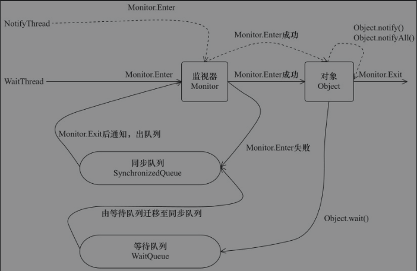

<center>java并发编程艺术-wait_notify</center>

### 4.3.3 等待/通知的经典范式

**等待方：**

步骤：

- 获取对象的锁
- 如果条件不满足，调用wait，被通知后继续检查条件
- 条件满足执行逻辑

伪码：

```java
synchronized (对象) {
    while(true){
        if (不满足条件) {
            wait();
        }
    }
    // 逻辑
}
```

**通知方：**

步骤：

- 获取对象的锁
- 改变条件
- 通知所有等待在该对象的线程

伪码：

```java
synchronized (对象) {
    flag = true;
    对象.notifyAll();
}
```

### 4.3.4 管道输入输出流

和普通流区别，用于线程之间数据传输，传输媒介是内存

实现类：

- PipedOutputStream、PipedInputStream： 面向字节
- PipedReader、PipedWriter：面向字符

一个示例，来自[https://www.yiibai.com/java_io/java_io_pipe.html](https://www.yiibai.com/java_io/java_io_pipe.html)

```java
public class Main {
  public static void main(String[] args) throws Exception {
    PipedInputStream pis = new PipedInputStream();
    PipedOutputStream pos = new PipedOutputStream();
    pos.connect(pis);   // 这里是一定要连接的

    Runnable producer = () -> produceData(pos);
    Runnable consumer = () -> consumeData(pis);
    new Thread(producer).start();
    new Thread(consumer).start();
  }

  public static void produceData(PipedOutputStream pos) {
    try {
      for (int i = 1; i <= 50; i++) {
        pos.write((byte) i);
        pos.flush();
        System.out.println("Writing: " + i);
        Thread.sleep(500);
      }
      pos.close();
    } catch (Exception e) {
      e.printStackTrace();
    }
  }
  public static void consumeData(PipedInputStream pis) {
    try {
      int num = -1;
      while ((num = pis.read()) != -1) {
        System.out.println("Reading: " + num);
      }
      pis.close();
    } catch (Exception e) {
      e.printStackTrace();
    }

  }
}

```

### 4.3.5 join

如果一个线程A执行了thread.join()语句，其含义是：当前线程A等待thread线程终止之后才从thread.join()返回。

另有超时的方法 join(long), join(long,int)


### 4.3.6 ThreadLocal

ThreadLocal，是一个以ThreadLocal对象为键、任意对象为值的存储结构。这个结构被附带在线程上，也就是说一个线程可以根据一个ThreadLocal对象查询到绑定在这个线程上的一个值.


 ## 4.4 线程应用实例

 ### 4.4.1 等待超时模式

 类似上面的等待通知模式，调用wait(long) 加入超时的控制，防止一致被阻塞

 ### 4.4.2 一个简单的数据库连接池示例

实质就是4.4.1的一个实际的例子

测试时使用了CountDownLatch这个类，[参考](https://www.cnblogs.com/dolphin0520/p/3920397.html)

### 4.4.3 线程池技术及其示例

- 线程的创建会消耗资源
- 考虑将线程池化，用的时候取，用完归还，此之为线程池

### 4.4.5 一个基于线程池技术的简单Web服务器

这是一个运用线程池技术的案例，里边不仅涉及到线程池技术，也涉及socket编程。案例不难，但很好，这里直接贴出来

```java
public class SimpleHttpServer {
    // 处理HttpRequest的线程池
    static ThreadPool<HttpRequestHandler> threadPool = new DefaultThreadPool<HttpRequestHandler>(11);
    // SimpleHttpServer的根路径
    static String basePath;
    static ServerSocket                   serverSocket;
    // 服务监听端口
    static int                            port       = 8080;
 
    public static void setPort(int port) {
        if (port > 0) {
            SimpleHttpServer.port = port;
        }
    }
 
    public static void setBasePath(String basePath) {
        if (basePath != null && new File(basePath).exists() && new File(basePath).isDirectory()) {
            SimpleHttpServer.basePath = basePath;
        }
    }
 
    // 启动SimpleHttpServer
    public static void start() throws Exception {
        serverSocket = new ServerSocket(port);
        Socket socket = null;
        while ((socket = serverSocket.accept()) != null) {
            // 接收一个客户端Socket，生成一个HttpRequestHandler，放入线程池执行
            threadPool.execute(new HttpRequestHandler(socket));
        }
        serverSocket.close();
    }
 
    static class HttpRequestHandler implements Runnable {
 
        private Socket socket;
 
        public HttpRequestHandler(Socket socket) {
            this.socket = socket;
        }
 
        @Override
        public void run() {
            String line = null;
            BufferedReader br = null;
            BufferedReader reader = null;
            PrintWriter out = null;
            InputStream in = null;
            try {
                reader = new BufferedReader(new InputStreamReader(socket.getInputStream()));
                String header = reader.readLine();
                // 由相对路径计算出绝对路径
                String filePath = basePath + header.split(" ")[1];
                out = new PrintWriter(socket.getOutputStream());
                // 如果请求资源的后缀为jpg或者ico，则读取资源并输出
                if (filePath.endsWith("jpg") || filePath.endsWith("ico")) {
                    in = new FileInputStream(filePath);
                    ByteArrayOutputStream baos = new ByteArrayOutputStream();
                    int i = 0;
                    while ((i = in.read()) != -1) {
                        baos.write(i);
                    }
 
                    byte[] array = baos.toByteArray();
                    out.println("HTTP/1.1 200 OK");
                    out.println("Content-Type: image/jpeg");
                    out.println("Content-Length: " + array.length);
                    out.println("");
                    socket.getOutputStream().write(array, 0, array.length);
                } else {
                    br = new BufferedReader(new InputStreamReader(new FileInputStream(filePath)));
                    out = new PrintWriter(socket.getOutputStream());
                    out.println("HTTP/1.1 200 OK");
                    out.println("Content-Type: text/html; charset=UTF-8");
                    out.println("");
                    while ((line = br.readLine()) != null) {
                        out.println(line);
                    }
                }
                out.flush();
            } catch (Exception ex) {
                out.println("HTTP/1.1 500");
                out.println("");
                out.flush();
            } finally {
                close(br, in, reader, out, socket);
            }
        }
    }
 
    // 关闭流或者Socket
    private static void close(Closeable... closeables) {
        if (closeables != null) {
            for (Closeable closeable : closeables) {
                try {
                    closeable.close();
                } catch (Exception ex) {
                    // 忽略
                }
            }
        }
    }
	
    public static void main(String[] args) {  
	basePath = "C:/Users/lenovo/Desktop";  
	SimpleHttpServer.setBasePath(basePath);  
	try{  
		start();  
	}catch(Exception e){  
		e.printStackTrace();  
	}  
    }
}

————————————————
版权声明：本文为CSDN博主「样young」的原创文章，遵循CC 4.0 BY-SA版权协议，转载请附上原文出处链接及本声明。
原文链接：https://blog.csdn.net/jisuanjiguoba/java/article/details/80548045
```


# 第5章 java中的锁

## 5.1 Lock接口

锁是用来控制多个线程访问共享资源的方式，一般来说，一个锁能够防止多个线程同时访问共享资源（但是有些锁可以允许多个线程并发的访问共享资源，比如读写锁）


锁和synchronized都是线程同步的工具， 主要区别如下：

1. synchronized是隐式获取释放锁，比较简单和固定，Lock是需要手动获取锁和释放，比较灵活
2. Lock可以尝试非阻塞获取锁、能被中断的获取锁、能够带超时的获取锁， synchronized不能做到

Lock的API:

|方法|说明|
|----|---|
|void lock()|获取锁。调用方法会获取锁，直到锁获取后返回|
|void lockInterruptibly() throws InterruptedException|可中断获取锁，在获取锁的过程中可以被中断，被中断后抛出异常返回|
|boolean tryLock()|尝试非阻塞的获取锁，立即返回，拿到锁返回true，否则false|
|boolean tryLock(long time, TimeUnit unit) throws InterruptedException|超时的获取锁<br/>返回的情况<br/>1. 在超时时间内获取到了锁，返回true<br/>2. 被中断了，抛出异常返回<br/>3. 超时时间到，返回false|
|void unlock()|释放锁|
|Condition newCondition()|获取等待通知组件，只有拿到了锁，才能拿到这个对象，调用wait()方法，调用后释放锁|


**不要将获取锁的过程写在try块中，因为如果在获取锁（自定义锁的实现）时发生了异常，异常抛出的同时，也会导致锁无故释放。**


## 5.2 队列同步器AbstractQueuedSynchronizer（AQS)

- 用来构建锁或者其他同步组件的基础框架
- 同步器是实现锁（也可以是任意同步组件）的关键，在锁的实现中聚合同步器，利用同步器实现锁的语义。


### 5.2.1 队列同步器的接口与示例

同步器访问和修改状态的三个方法

- getState()
- setState()
- compareAndSetState(): CAS操作保证原子性

可重写方法：

- protected boolean tryAcquire(int arg): 独占式获取同步状态，在此方法中需要查询当前状态并判断是否符合预期，然后CAS设置同步状态
- protected boolean tryRelease(int arg)： 独占式释放同步状态，  等待获取同步状态的线程有机会拿到同步状态
- protected int tryAcquireShared(int arg)：共享式获取同步状态，返回>=0表示获取成功，否则表示获取失败
- protected boolean tryReleaseShared(int arg)：共享式释放同步状态
- protected boolean isHeldExclusively()：当前同步器是否在独占模式下被线程占用

AQS提供的模板方法：

- public final void acquire(int arg)： 独占式获取同步状态，获取成功则返回，否则进入同步队列等待，会调用重写的tryAcquire(int arg)
- public final void acquireInterruptibly(int arg)：独占是获取同步状态，但是能响应中断，被中断抛异常
- public final boolean tryAcquireNanos(int arg, long nanosTimeout)：独占是获取同步状态，能响应中断，且有超时，超时返回false
- public final void acquireShared(int arg)：共享式获取同步状态，没获取到则进入同步队列，同一时刻可以有多个线程获取到同步状态
- public final void acquireSharedInterruptibly(int arg)：可以被中断
- public final boolean tryAcquireSharedNanos(int arg, long nanosTimeout)：带超时，且能被中断
- public final boolean release(int arg)：独占式释放同步状态，释放后会将同步队列第一个节点唤醒
- public final boolean releaseShared(int arg): 共享式释放同步状态；
- public final Collection<Thread> getQueuedThreads(): 获取同步队列里的线程


一个独占锁的示例：

```java
public class Mutex implements Lock {
    private static class Sync extends AbstractQueuedSynchronizer {

        private static final long serialVersionUID = -9167644904979247261L;

        protected Sync() {
            super();
        }

        @Override
        protected boolean tryAcquire(int arg) {
            if (compareAndSetState(0, 1)) {
                setExclusiveOwnerThread(Thread.currentThread());
                return true;
            }
            return false;
        }

        @Override
        protected boolean tryRelease(int arg) {
            if (getState() == 0) {
                throw new IllegalMonitorStateException();
            }
            setExclusiveOwnerThread(null);
            setState(0);
            return true;
        }

        @Override
        protected int tryAcquireShared(int arg) {
            return super.tryAcquireShared(arg);
        }

        @Override
        protected boolean tryReleaseShared(int arg) {
            return super.tryReleaseShared(arg);
        }

        @Override
        protected boolean isHeldExclusively() {
            return getState() == 1;
        }

        @Override
        public String toString() {
            return super.toString();
        }

        Condition newCondition() {
            return new ConditionObject();
        }
    }

    private final Sync sync = new Sync();


    @Override
    public void lock() {
        sync.acquire(1);
    }

    @Override
    public void lockInterruptibly() throws InterruptedException {
        sync.acquireInterruptibly(1);
    }

    @Override
    public boolean tryLock() {
        return sync.tryAcquire(1);
    }

    @Override
    public boolean tryLock(long time, TimeUnit unit) throws InterruptedException {
        return sync.tryAcquireNanos(1, unit.toNanos(time));
    }

    @Override
    public void unlock() {
        sync.tryRelease(1);
    }

    @Override
    public Condition newCondition() {
        return sync.newCondition();
    }
}

```

### 5.2.2 AQS实现分析

#### 同步队列

AQS依赖内部的同步队列来完成同步状态的管理，当前线程获取同步状态失败时，AQS会将当前线程以及等待状态等信息构造成为一个节点（Node）并将其加入同步队列，同时会阻塞当前线程，当同步状态释放时，会把首节点中的线程唤醒，使其再次尝试获取同步状态。

- 同步队列的节点

**int waitStatus**

CANCELLED=1：同步队列中的线程等待超时或被中断，需要取消等待，到达这个状态后将不会再变化了

SIGNAL=-1：后继节点处于等待状态，当前节点释放了同步状态或者超时或者被中断会通知后继节点

CONDITION = -2：节点在等待队列中，等待在Condition上，其他线程调用了Condition的signal后，该节点从等待队列转移到同步队列，加入到对同步状态的获取中

PROPAGATE = -3：表示下一次共享是同步状态获取将会无限制传播下去

INITIAL=0:初始状态

**Node prev**

前驱节点

**Node next**

后继节点

**Node nextWaiter**

等待队列中的后继节点。如果当前节点是共享节点，那么该字段值未SHARED常量

**Thread thread**

获取到同步状态的线程

- 同步队列的操作

同步队列是双向队列，有一个头节点和尾节点，入队主要是尾节点引用变化，出队头节点引用变化

- 入队：必须要保证线程安全，因此同步器提供了一个基于CAS的设置尾节点的方法：compareAndSetTail(Node expect, Node update)
- 出队：设置首节点是通过获取同步状态成功的线程来完成的，由于只有一个线程能够成功获取到同步状态，因此设置头节点的方法并不需要使用CAS来保证


#### 独占式同步状态的获取与释放

- 获取

通过调用同步器的acquire(int arg)方法可以获取同步状态，该方法对中断不敏感，也就是由于线程获取同步状态失败后进入同步队列中，后续对线程进行中断操作时，线程不会从同步队列中移出。

具体步骤：

调用自定义同步器实现的tryAcquire(intarg)方法，若失败，创建同步节点，加入同步队列

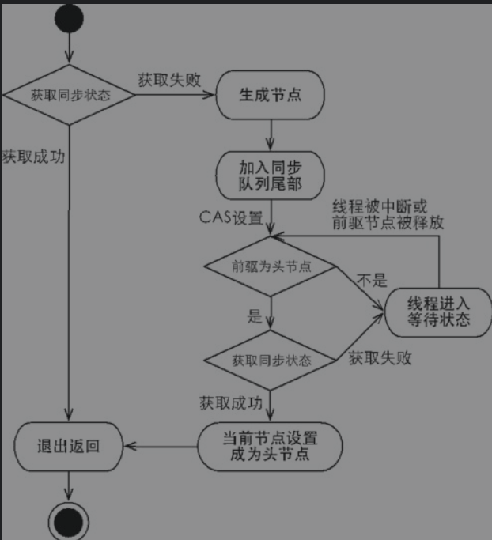

- 释放

通过调用同步器的release(int arg)方法可以释放同步状态，该方法在释放了同步状态之后，会唤醒其后继节点

#### 共享式同步状态获取与释放

共享式获取与独占式获取最主要的区别在于同一时刻能否有多个线程同时获取到同步状态。

通过调用同步器的acquireShared(int arg)方法可以共享式地获取同步状态


通过调用releaseShared(intarg)方法可以释放同步状态，它和独占式主要区别在于tryReleaseShared(int arg)方法必须确保同步状态（或者资源数）线程安全释放，一般是通过循环和CAS来保证的，因为释放同步状态的操作会同时来自多个线程。

#### 独占式超时获取同步状态
通过调用同步器的doAcquireNanos(int arg, long nanosTimeout)方法可以超时获取同步状态


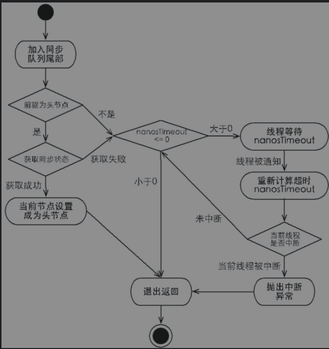


#### 自定义同步组件——TwinsLock

这是一个例子

设计一个同步工具：该工具在同一时刻，只允许至多两个线程同时访问，超过两个线程的访问将被阻塞，我们将这个同步工具命名为TwinsLock。


## 5.3 重入锁（ReentrantLock）

### 定义

就是支持重进入的锁，它表示该锁能够支持一个线程对资源的重复加锁。除此之外，该锁的还支持获取锁时的公平和非公平性选择。

**synchronized是可重入的**

### 重新进入的实现原理

- 1）线程再次获取锁。锁需要去识别获取锁的线程是否为当前占据锁的线程，如果是，则再次成功获取。
- 2）锁的最终释放。线程重复n次获取了锁，随后在第n次释放该锁后，其他线程能够获取到该锁。锁的最终释放要求锁对于获取进行计数自增，计数表示当前锁被重复获取的次数，而锁被释放时，计数自减，当计数等于0时表示锁已经成功释放。

### 公平锁与非公平锁的区别

公平锁获取锁的方法与nonfairTryAcquire(int acquires)比较，唯一不同的位置为判断条件多了hasQueuedPredecessors()方法，即加入了同步队列中当前节点是否有前驱节点的判断，如果该方法返回true，则表示有线程比当前线程更早地请求获取锁，因此需要等待前驱线程获取并释放锁之后才能继续获取锁。

非公平性锁可能造成线程“饥饿”，但极少的线程切换，保证了其更大的吞吐量。

公平锁会带来更多的线程切换，因此在高并发下性能会差一些。

## 5.4 读写锁（ReentrantReadWriteLock）

- 读写锁在同一时刻允许多个线程访问
- 当一个写线程访问时，所有其他线程阻塞
- 当一个读线程访问时，其他读线程不会被阻塞
- 读写锁维护了一对锁，一个读锁和一个写锁，通过分离读锁和写锁，使得并发性相比一般的排他锁有了很大提升。
- 在读多于写的情况下，读写锁能够提供比排它锁更好的并发性和吞吐量

特性：

- 支持公平锁与非公平锁
- 可重入
- 支持锁降级：遵循获取写锁、获取读锁再释放写锁的次序，写锁能够降级为读锁

核心API：

- ReentrantReadWriteLock.ReadLock  readLock()： 获取读锁
- ReentrantReadWriteLock.WriteLock writeLock()： 获取写锁
- int getReadLockCount()：返回当前读锁被获取到的次数，与线程数无关，同一个线程获取n次 返回n
- int getReadHoldCount()：返回当前线程获取读锁的次数
- boolean isWriteLocked()：判断读锁是否被获取了
- int getWriteHoldCount()：获取当前写锁被获取的次数


### 5.4.1 读写锁的实现分析


- 读写状态设计

仍然是使用AQS的同步状态，同步状态时32位整形，我们需要用它表示读线程的状态和写线程的状态，因此需要拆分使用，高16位表示写状态、低16位标识读状态。

假设当前同步状态值为S，写状态等于S&0x0000FFFF，读状态等于S>>>16（无符号补0右移16位）。当写状态增加1时，等于S+1，当读状态增加1时，等于S+(1<<16)，也就是S+0x00010000。


- 写锁的获取与释放

写锁是一个支持重进入的排它锁。如果当前线程已经获取了写锁，则增加写状态。如果当前线程在获取写锁时，读锁已经被获取（读状态不为0）或者该线程不是已经获取写锁的线程，则当前线程进入等待状态。

写锁的释放与ReentrantLock的释放过程基本类似，每次释放均减少写状态，当写状态为0时表示写锁已被释放，从而等待的读写线程能够继续访问读写锁，同时前次写线程的修改对后续读写线程可见。

- 读锁的获取与释放

读锁是一个支持重进入的共享锁，它能够被多个线程同时获取，在没有其他写线程访问（或者写状态为0）时，读锁总会被成功地获取，而所做的也只是（线程安全的）增加读状态。如果当前线程已经获取了读锁，则增加读状态。如果当前线程在获取读锁时，写锁已被其他线程获取，则进入等待状态。


- 锁降级

锁降级指的是写锁降级成为读锁。锁降级是指把持住（当前拥有的）写锁，再获取到读锁，随后释放（先前拥有的）写锁的过程。

锁降级的例子

xxxx

为什么要有锁降级

主要是为了保证数据的可见性，如果当前线程不获取读锁而是直接释放写锁，假设此刻另一个线程（记作线程T）获取了写锁并修改了数据，那么当前线程无法感知线程T的数据更新。如果当前线程获取读锁，即遵循锁降级的步骤，则线程T将会被阻塞，直到当前线程使用数据并释放读锁之后，线程T才能获取写锁进行数据更新。

RentrantReadWriteLock不支持锁升级（把持读锁、获取写锁，最后释放读锁的过程）。目的也是保证数据可见性，如果读锁已被多个线程获取，其中任意线程成功获取了写锁并更新了数据，则其更新对其他获取到读锁的线程是不可见的。


## 5.5 LockSupport工具

当需要阻塞或唤醒一个线程的时候，都会使用LockSupport工具类来完成相应工作。LockSupport定义了一组的公共静态方法，这些方法提供了最基本的线程阻塞和唤醒功能，而LockSupport也成为构建同步组件的基础工具。

- static void park(): 阻塞当前线程，调用static void unpark(Thread thread)，或者当前线程被中断才返回
- static void parkNanos(long nanos)： 加上了超时的支持
- static void parkUntil(long deadline)：阻塞当前线程直到deadline
- static void unpark(Thread thread): 唤醒处于阻塞状态的线程thread
- static void park(Object blocker)
- static void parkNanos(Object blocker, long nanos)
- static void parkUntil(Object blocker, long deadline)

*brocker可以标识阻塞对象*


## 5.6 Condition接口

- 任意一个Java对象，都拥有一组监视器方法（定义在java.lang.Object上），主要包括wait()、wait(long timeout)、notify()以及notifyAll()方法，这些方法与synchronized同步关键字配合，可以实现等待/通知模式

- Condition接口也提供了类似Object的监视器方法，与Lock配合可以实现等待/通知模式


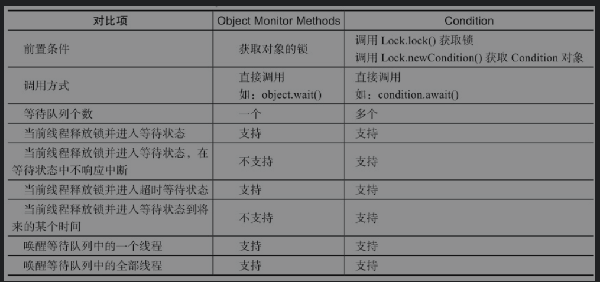

<center>Object的监视器方法和Condition对比</center>


### 5.6.1 Condition接口与示例


Condition定义了等待/通知两种类型的方法，当前线程调用这些方法时，需要提前获取到Condition对象关联的锁

一般都会将Condition对象作为成员变量。当调用await()方法后，当前线程会释放锁并在此等待，而其他线程调用Condition对象的signal()方法，通知当前线程后，当前线程才从await()方法返回，并且在返回前已经获取了锁。

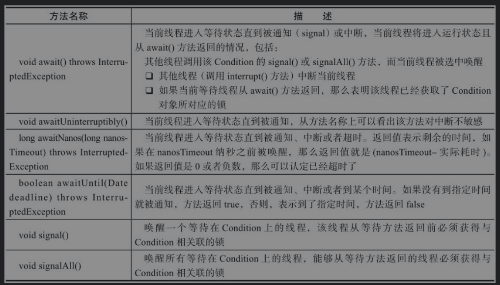

<center>Condition的一些方法</center>


一个实现有界队列的例子

思考思考
cxxxxxx

### 5.6.2 Condition的实现原理

ConditionObject是同步器AbstractQueuedSynchronizer的内部类，因为Condition的操作需要获取相关联的锁，所以作为同步器的内部类也较为合理。每个Condition对象都包含着一个队列（以下称为等待队列），该队列是Condition对象实现等待/通知功能的关键。

**等待队列**

- 是一个FIFO队列
- 对列中每个节点包含了在Condition对象上等待的队列的引用
- 如果一个线程调用了Condition.await()，那么该线程将释放锁，构建节点进入等待队列等待
- 这个节点和同步队列的节点是一样的
- 入队和出队是不用做CAS的，因为线程获取了锁

**等待**


当调用await()方法时，相当于同步队列的首节点（获取了锁的节点）移动到Condition的等待队列中。

然后释放同步状态，唤醒同步队列中的后继节点，然后当前线程会进入等待状态。

**通知**

调用Condition的signal()方法，将会唤醒在等待队列中等待时间最长的节点（首节点），在唤醒节点之前，会将节点移到同步队列中。


## 提到的工具

- jstack
- javap


